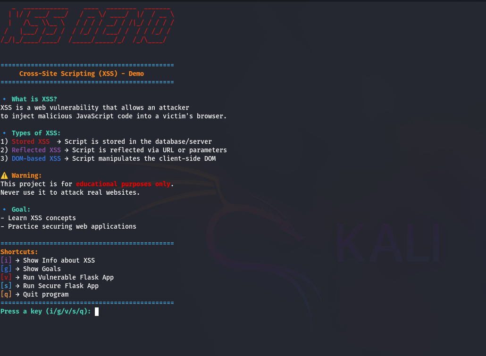

---

# XSS-Demo-Edu 🚀👾


** Hands-On Hacking Lab:** Safely explore **Cross-Site Scripting (XSS)** attacks on localhost with this educational project.

---

##  Important Warnings

*  Do **NOT** run on real websites
*  Only run on **localhost** (`127.0.0.1`)
*  Vulnerable mode is unsafe, use **only for learning**
*  Secure mode is safe and recommended

---

## 🛠 Installation on Linux / MacOS

### Step 1: Clone the repository

```bash
git clone https://github.com/YourUsername/XSS-Demo-Edu.git
```

### Step 2: Move into the directory

```bash
cd XSS-Demo-Edu
```

### Step 3: Install dependencies

```bash
pip install -r requirements.txt
```

### Step 4: Run the program

```bash
python3 xss_demo.py
```

---

##  Menu Options

```
Select an Option:

[i] → Show Info about XSS
[g] → Show Project Goals
[v] → Run Vulnerable Flask App
[s] → Run Secure Flask App
[q] → Quit
```

* **\[i]** → Learn about XSS
* **\[g]** → Show project goals
* **\[v]** → Run the vulnerable app (test `<script>alert('XSS')</script>`)
* **\[s]** → Run the secure app (input is escaped)
* **\[q]** → Quit the menu

---

##  Screenshots

Main menu in terminal:

```
+==============================================+
|                 XSS DEMO                     |
|----------------------------------------------|
| [i] → Info about XSS                         |
| [g] → Show Goals                             |
| [v] → Run Vulnerable Flask App               |
| [s] → Run Secure Flask App                   |
| [q] → Quit                                   |
+==============================================+
```

Browser vulnerable app example:



> Replace `screenshot.png` with your actual terminal/browser screenshot.

---

##  Learning Outcomes

* 🔹 Learn **types of XSS**: Stored, Reflected, DOM-based
* 🔹 Understand how **unsanitized user input** can be exploited
* 🔹 Compare **vulnerable** vs **safe** behavior
* 🔹 Practice **secure coding** for web applications
* 🔹 Build a **hacker mindset safely**

---

##  Goal

Provide a **safe hacking lab** to test XSS attacks and learn secure coding practices.

---

## Requirements

```
Flask
pyfiglet
termcolor
```

> Install dependencies with:

```bash
pip install -r requirements.txt
```


